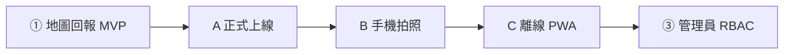

# BIH 開發進度紀錄

> 最後更新：**2026-05-27**（階段 1 收尾清單、下一里程碑：上線 → 手機拍照 → 離線）

## 部署定案（全階段共用）

| 元件 | 服務 |

|------|------|

| Contributor Web | Cloudflare Pages（`frontend/dist`） |

| API | FastAPI（Fly / Railway / Render 等常駐主機） |

| 資料庫 | Neon Postgres + PostGIS |

| 相片 | Cloudflare R2 |

| 行動端（後續） | Capacitor 獨立 repo `BIH-client`，`webDir` 指同一套 `dist` |

**產品原則（Contributor）**：災害初發時管理員可能尚未畫定事件範圍 → **任意地點回報**（`geom` / 文字地標 / 可選 `building_id`）。`crises.bounds` 僅供管理端**事後參考**（第三階段），不做 Contributor 提交門檻。

---

## 下一里程碑（建議順序）

| 順序 | 目標 | 說明 |

|------|------|------|

| **A** | **正式上線** | Pages + API + Neon migrations + R2（或生產 `UPLOAD_VIA_API`）；`DEPLOYMENT.md` 檢查清單；冒煙測試：開窗、markers、提交、編輯刪除 |

| **B** | **手機拍照** | Web 表單已有 `capture="environment"`；上線後補 **Capacitor Camera**（或同等功能）與權限、壓縮、EXIF 策略；可選先建 `BIH-client` 殼 |

| **C** | **第二階段：離線 PWA** | 在 A/B 穩定後：PWA 殼、同步狀態機、離線填報 E2E、與 `MapPage` 完整整合 |

---

## 第一階段：Contributor 地圖回報（收尾中 → 待上線）

### 目標

- Map-first：Leaflet + OSM；三模式（全部 / 我的 / 新增）。

- 建物 footprint、GPS 定位、點選／拖移圖釘／「+」進入新增、**◎** 在 GPS 放置回報圖釘。

- 線上：presign → 上傳圖片 → `POST /v1/reports`；可編輯／刪除自己的回報（`X-Device-Id` + `reporter_hash`）。

- 公開讀取：`/v1/public/active-window`、`/v1/public/markers`（`reporting_unbounded: true`）。

### 已完成

| 區塊 | 內容 |

|------|------|

| **後端 API** | `public` 視窗、markers、`my-contribution`；`reports` POST/PATCH/DELETE；`uploads` presign + receive；`duplicate` 啟發式 + `possible_duplicate`；`description_language` 含 zh-Hant/de/pt；Neon 503 / `CAST(:cid AS uuid)` |

| **上傳** | R2 可選；本機 localhost **API 代傳 R2**；`UPLOAD_VIA_API` 可覆寫 |

| **資料庫** | `init.sql` 示範危機；migrations `002`–`004`；demo markers |

| **前端地圖** | `MapPage`、`ContributorMap`、`ReportSheet`、`PlacementBar`、`LocationPanel`；**leaflet.markercluster**；同點 **單燈號**（最嚴重損壞 + 最新「已修復／已拆除」覆蓋） |

| **Contributor UX** | 兩步新增；marker／建物 **先 Popup、再詳情**；表單 **現場狀況**（合併損壞＋修復／拆除）；觀測時間新增／編輯皆可改；設施名稱＋文字路標順序；**+** 僅進新增、**◎** 放 GPS 圖釘；取消新增橫幅；表單重掛載防殘留 |

| **參與激勵（階段1）** | 貢獻條（無排行榜）、重複提交黃色提示、`GET /v1/public/my-contribution` |

| **響應式** | 手機：圖例／貢獻條可收合；右上欄直排不與連結重疊；PlacementBar 單行座標 |

| **i18n** | en 預設；zh-Hant、de、pt 等；九語系 key 補齊（核心路徑） |

| **離線（基礎）** | IndexedDB 佇列、`OfflineBanner`、`queue.ts`（**尚未**與地圖流程完整驗收） |

| **文件** | `DEPLOYMENT.md`、`NEON_CONNECTIVITY.md`、`scripts/check_db.py` |

### 上線前檢查（優先）

- [ ] **正式部署**：Pages + API + Neon schema/migrations + R2 CORS（或 `UPLOAD_VIA_API=true`）。

- [ ] **生產冒煙**：active-window、markers、提交含圖、編輯／刪除、mine 模式、`X-Device-Id` 持久化。

- [ ] **驗收抽樣**（對照 `MODULE_SPEC.md` §15）：六語／RTL 抽測、匯出與 DB 一致。

### 上線後、進離線前（手機拍照）

- [ ] **Capacitor 殼**：`BIH-client` repo 或 monorepo `mobile/`，`webDir` → `frontend/dist`。

- [ ] **原生拍照**：`@capacitor/camera`（或規格定案方案）；權限文案；與既有 `compressImage`、上傳流程串接。

- [ ] **實機測試**：iOS / Android 相機、相簿、橫豎屏。

### 第一階段其餘待辦（可與 A/B 並行或延後）

- [ ] 地圖 API 請求 abort／重試按鈕；編輯時帶回建物名稱。

- [ ] `/dev`、`ReportNew` 與地圖首頁導覽／文件統一說明。

- [ ] 自動化 API／E2E 測試。

- [ ] Neon 開發：VPN 說明；可選本機 `docker compose` PostGIS。

### 第一階段相關路徑

| 用途 | 路徑 |

|------|------|

| 地圖頁 | `frontend/src/pages/MapPage.tsx` |

| 現場狀況 | `frontend/src/utils/siteCondition.ts`、`SiteConditionField.tsx` |

| 叢集標記 | `frontend/src/components/map/ClusteredReportMarkers.tsx` |

| 提交佇列 | `frontend/src/offline/queue.ts` |

| 公開 API | `backend/app/routers/public.py` |

| 重複偵測 | `backend/app/duplicate.py` |

---

## 第二階段：離線填報（進行中 — C1 填報閉環）

### 產品決案（2026-05-27）

- **離線重點**：僅 **新增回報** 入佇列並同步；**不做** 離線瀏覽 markers／footprint。
- **優先順序**：**C1 填報閉環** → C2 PWA 殼 → C4 地圖瓦片（選做）。
- **事件模型**：回報先一律進 **`unspecified`**（`bounds = NULL`）；管理員事後劃範圍／時間窗，再調整**顯示**（不阻擋提交）。見 `docs/CRISIS_LIFECYCLE.md`。

### C1 目標

- 曾 **連線開過一次** → 危機設定寫入本機；之後飛航模式可進地圖、**+／◎** 新增回報、拍照／相簿、送出入佇列。
- 恢復網路 → `OfflineBanner` 自動／手動 `syncQueue`。
- 從未連線且無快照 → 明確提示「請先連線載入危機」。

### 現況

| 項目 | 狀態 |
|------|------|
| IndexedDB 佇列（相片 + payload） | 已有（`queue.ts`） |
| 危機快照 `crisis_snapshot` | **已做**（`crisisCache.ts` + `useActiveWindow`） |
| `MapPage` 離線填報模式 | **已做**（跳過 markers/buildings API、離線橫幅） |
| `ReportSheet` 離線入佇列 | 已有 |
| `OfflineBanner` + `syncQueue` | 已有，待 E2E 驗收 |
| 同步狀態機細分（uploading_image 等） | 待做 |
| 佇列列表／失敗重試 UI | 待做 |
| PWA / SW | 待做（C2） |
| 離線地圖瓦片 | **不做**（C1 範圍外） |

### C1 剩餘待辦

1. 飛航模式 E2E 驗收（填報含圖 → 上線 → Neon 有資料）。
2. 佇列明細 UI（待同步筆數已有 banner）。
3. 對齊 `MODULE_SPEC` 同步狀態枚舉（可選）。
4. `docs/OFFLINE.md` 離線限制說明。

### C2 之後（摘要）

- `vite-plugin-pwa`、安全 SW、可安裝到主畫面。
- Capacitor Network 插件、背景同步（選做）。

---

## 第三階段：管理員畫框 / RBAC（未開始）

### 目標

- 管理端劃定／調整 `crises.bounds`（**事後參考**）。

- RBAC、審核、匯出、危機管理；儀表板與 `latest_report_per_building` 等。

### 現況

| 項目 | 狀態 |

|------|------|

| `/admin` + `X-Admin-Token` | 雛形已有 |

| Migration `002`、`004` | 已有 |

| 地圖畫框編輯 UI | 未做 |

---

## 路線圖總覽

| 階段 | 名稱 | 狀態 |

|------|------|------|

| ① | Contributor 地圖回報 | **收尾中**（功能可跑；待 **A 上線**） |

| A | 正式上線 | **下一步** |

| B | 手機拍照（Capacitor） | 上線後、離線前 |

| ② | 離線 PWA | 待啟動 |

| ③ | 管理員畫框 / RBAC | 未開始 |

---

## 變更日誌（近期）

| 日期 | 項目 |

|------|------|

| 2026-05-27 | 路線圖更新：上線 → 手機拍照 → 離線；文件同步近期 UX／現場狀況／定位圖釘修正 |

| 2026-05-26 | **◎** 進新增並放圖釘；**+** 僅進新增不清 GPS；Popup 優先；合併 **現場狀況**；參與激勵＋叢集；手機收合圖例／貢獻條 |

| 2026-05-26 | 兩步新增、PlacementBar、地點歷史、footprint 偵測、表單與 i18n、`description_language` 後端 |

| 2026-05-25 | Submit／R2 代傳；`buildings` 503；基本 markers |

| 較早 | 開放回報、Leaflet 首頁、demo markers、`reporting_unbounded` |

---

## 相關文件

- 功能規格：`docs/MODULE_SPEC.md`

- 部署：`docs/DEPLOYMENT.md`

- Neon 連線：`docs/NEON_CONNECTIVITY.md`

- 教學：`docs/tutorial.md`

